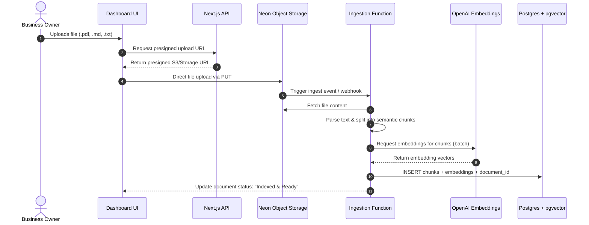
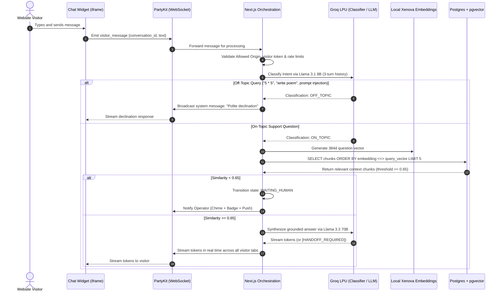
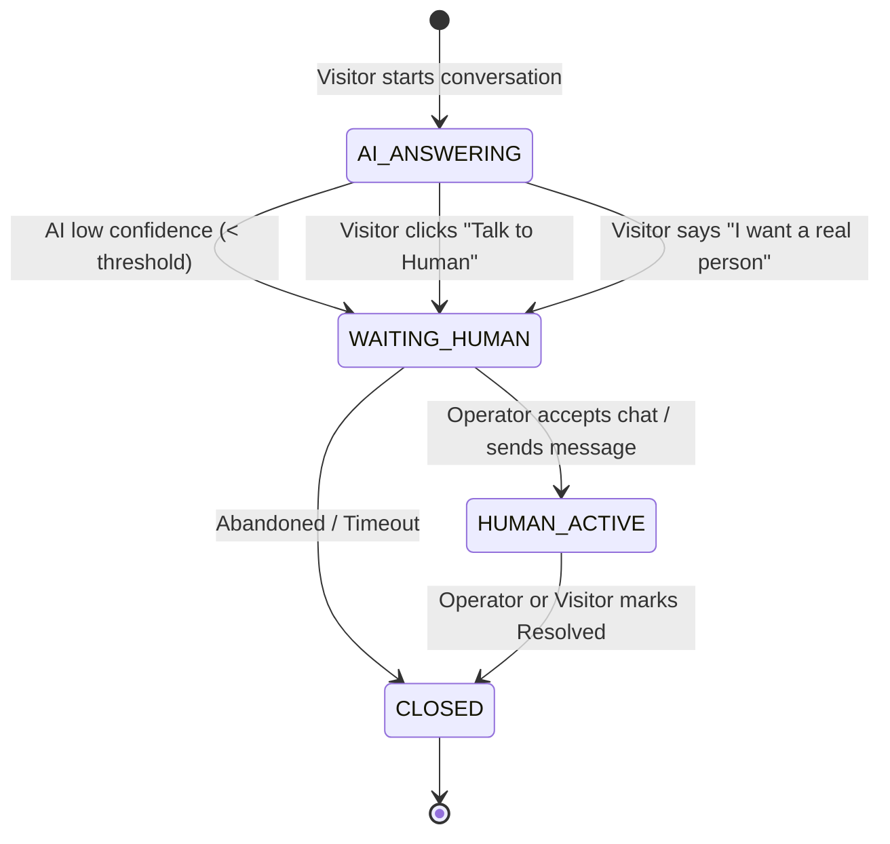

# Product Requirements Document (PRD): Heyo v1
**Real-Time Live Chat with Guardrailed AI Support Agent**

---

| **Field** | **Details** |
| :--- | :--- |
| **Product** | Heyo |
| **Document Stage** | v1.0 — Ready for Technical Conception & Engineering Execution |
| **Target Audience** | Engineering, Product, Design |
| **Framework** | Lenny's PRD Template & Ryan Singer Shaping Framework |

---

## 1. Executive Summary & Vision

**Heyo** is a lightweight, real-time customer support platform designed for modern businesses. It combines an embeddable website live chat widget with an autonomous, knowledge-grounded AI support agent. 

Unlike naive chatbot wrappers that answer anything (exposing businesses to prompt injection, hallucination, and exorbitant token costs), Heyo introduces a strict **Intent Classifier Gate** and **Domain-Bounded RAG pipeline**. The AI answers customer queries strictly from the company's uploaded documentation (PDFs, Markdown, docs). When confidence is low or when a visitor requests a person, the conversation seamlessly hands off to a human operator in real time.

```
+-----------------------------------------------------------------------------------------+
|                                    HEYOS VALUE PROPOSITION                              |
|                                                                                         |
|   Website Visitor                   Heyo Triage Pipeline                   Support Team  |
|   +---------------+                 +--------------------+                 +----------+ |
|   | Asks question | --------------->| 1. Classify Intent |                 | Dashboard| |
|   +---------------+                 | 2. Search Vectors  |                 +----------+ |
|           ^                         | 3. Synthesize Ans  |                      ^       |
|           |                         +--------------------+                      |       |
|           |                                   |                                 |       |
|           +====== Real-time stream (PartyKit) =+====== If unsure / requested ===+       |
+-----------------------------------------------------------------------------------------+
```

---

## 2. Problem Statement

### The Customer Problem (Website Visitors & End Users)
Website visitors frequently have immediate pre-sale or support questions while browsing a product. Traditional ticketing systems (or email-based support forms) take hours or days to respond, causing bounce and lost conversions. Conversely, generic AI chatbots frequently invent policies, generate irrelevant prose, or fail silently without offering an escalation path to an actual human.

### The Business Problem (Companies & Operators)
1. **Support Overhead:** Small-to-mid-sized teams cannot provide 24/7 live chat coverage, yet 70%+ of customer inquiries are repetitive questions already documented in their setup guides or FAQs.
2. **Token Burn & Attack Surface:** Unrestricted LLM chat widgets are routinely abused by website visitors (e.g., "write me a Python script", "solve my homework", "ignore previous instructions"). Every off-topic query costs the business money and introduces brand liability.
3. **Clunky Handoffs:** Most automated bot tools operate in silos disconnected from live chat, resulting in fragmented context when a human finally steps in.

---

## 3. Success Metrics & Growth Levers

Aligned with the **Hila Qu Growth Lever Framework** and **Lenny's PRD Rubric**:

| Category | Metric | Baseline / Target (v1) | Growth Lever |
| :--- | :--- | :--- | :--- |
| **Primary (Core)** | **AI Resolution / Deflection Rate** | Target: $\ge 55\%$ of incoming valid questions resolved without human intervention | Retention & Efficiency |
| **Primary (UX)** | **First Response Time (FRT)** | AI: $< 800\text{ms}$ time-to-first-token streaming (via Groq LPUs); Human: $< 2\text{ min}$ when online | Activation & Conversion |
| **Safety & Cost** | **Off-Topic Declination Accuracy** | $\ge 98\%$ precision in filtering non-support queries at Step 3 | Margin & Security |
| **Reliability** | **Handoff Transition Latency** | $< 500\text{ms}$ state transition from `ai_active` $\rightarrow$ `waiting_human` | Customer Trust |
| **Accuracy** | **Hallucination Rate** | $< 2\%$ answers with unverified claims (measured via sample evaluation) | Brand Integrity |

---

## 4. User Personas & Job Stories

### Persona 1: Sarah — The Website Visitor
> *"When I am exploring a SaaS product and run into a question about their API pricing or feature limits, I want immediate, accurate answers right on the page, so that I can decide whether to sign up without waiting 24 hours for an email reply."*

### Persona 2: Alex — The Business Owner / Solopreneur
> *"When I publish updated documentation, I want the AI to ingest it within minutes and only speak truthfully from those docs, so that I don't have to stay glued to my inbox or worry about the AI making up fake refund promises."*

### Persona 3: Marcus — The Support Operator
> *"When a visitor has an unusual or frustrated query that the bot cannot resolve, I want to receive real-time notification with full conversational context and seamlessly take over, so that the visitor never feels abandoned."*

---

## 5. Scope & Boundary Shaping (In vs. Out of Scope)

### In-Scope for v1 (The Thin, Complete Slice)
1. **Embeddable Chat Widget**: Lightweight script embedding an `iframe` with persistent visitor session token (`localStorage`), manual "Talk to human" button, and optional host `identify({ email, name })` SDK.
2. **Real-time Messaging**: Bi-directional streaming and status updates powered by **PartyKit** WebSockets, with Next.js serving as single authority for database writes.
3. **Operator Dashboard**: Clean desktop web interface for Business Owners (single-member workspace with v2 organization foundation) to manage chats, view visitor context, and send live replies.
4. **Knowledge Ingestion (Flow A)**: Direct presigned uploads (.pdf, .md, .txt up to 10MB) to **Neon Object Storage**, background parsing, chunking, and vectorization into **Neon Postgres + `pgvector`** with cascading deletes on document removal.
5. **Guardrailed Question Answering (Flow B)**:
   - Request rate-limiting & visitor authentication check.
   - **Step 3 Intent Classifier**: Evaluates last 3 conversation turns via Groq `llama-3.1-8b-instant`. Categorizes message as On-Topic (including polite greetings) vs. Off-Topic before vector search.
   - **Context Search**: Similarity search via OpenAI embeddings (`text-embedding-3-small` 1536d) against chunk vectors.
   - **Grounded Answer Generation**: Groq `llama-3.3-70b-versatile` synthesizes answer citing only retrieved chunks. Dual guardrail triggers handoff if similarity $< 0.65$ or if LLM outputs `[HANDOFF_REQUIRED]`.
6. **Human Handoff (Flow C)**: 4-state lifecycle machine (`ai_active` $\rightarrow$ `waiting_human` $\rightarrow$ `human_active` $\rightarrow$ `closed`) with offline away message & email capture fallback.
7. **Authentication & Team Access**: Workspace authentication powered by **Better-Auth** (organization model prepared for v2 multi-member invitations).

### Explicit Non-Goals for v1 (What We Are NOT Building)
- ❌ **No Email / Asynchronous Ticketing**: No SMTP email routing, ticket queue SLAs, or thread-to-email forwarding.
- ❌ **No Public Help Center / Knowledge Portal**: No public-facing article browser or Notion-style CMS.
- ❌ **No Mobile Apps**: Responsive web dashboard only; native iOS/Android apps are deferred to v2.
- ❌ **No Complex Billing & Tier Limits**: No Stripe subscription paywalls in v1 core; focus purely on the operational software loop.
- ❌ **No Automated Outbound Campaigns / Product Tours**: No automated tooltips, onboarding checklists, or proactive promotional popups.

---

## 6. Core User Flows & System Interactions

### Flow A: Knowledge Ingestion (Owner / Team)



1. **Step 1 — Upload Request:** Dashboard calls `POST /api/documents/upload-url` with file metadata.
2. **Step 2 — Direct Upload:** Browser transfers binary data directly to object storage (bypassing Next.js memory limits).
3. **Step 3 — Chunking:** Ingestion worker splits text into overlapping windows (500 tokens with 50-token overlap).
4. **Step 4 — Embedding:** Local, 100% free vectorization via `@xenova/transformers` (`bge-small-en-v1.5`, 384 dimensions). Zero third-party API keys or token costs.
5. **Step 5 — Persistence:** Saved to Postgres `document_chunks` table with `vector(384)` index (HNSW).

---

### Flow B: Visitor Inquiries & Guardrailed AI Resolution



#### The Guardrail Gate: Intent Classification Rules
Before **any** vector search or RAG generation is performed:
- **Classifier Objective:** Determine if the message seeks help regarding the company's product, services, pricing, integration, or support.
- **Off-Topic Detection:** Math puzzles, creative writing, role-playing, coding prompts unrelated to the API, and adversarial system prompt leak attempts (`"Ignore previous instructions"`).
- **Execution:** Lightweight, ultra-fast classification prompt (temperature 0.0) returning JSON `{ "is_support_related": boolean, "reason": string }`.
- **Declination Message:** *"I am an automated assistant dedicated strictly to answering questions about [Business Name]. I cannot help with general requests or creative tasks, but I'm happy to help with our product!"*

---

### Flow C: Human Takeover Lifecycle & State Machine



1. **State 1 — `AI_ANSWERING` (Default):**
   - The AI responds to all visitor queries.
   - Operator dashboard displays the chat with a badge `"AI Handled"`.
2. **State 2 — `WAITING_HUMAN`:**
   - Triggered when:
     - The AI retrieval score falls below confidence threshold (e.g., max cosine similarity $< 0.68$).
     - The AI generation flags ambiguity (*"I don't have enough information in my docs to confirm that."*).
     - The visitor explicitly requests a human via button or keyword.
   - Action: AI stops automatic replies; sets conversation status to `WAITING_HUMAN`; emits audio/visual notification on Operator Dashboard.
3. **State 3 — `HUMAN_ACTIVE`:**
   - An operator sends a message from the dashboard.
   - The visitor sees the agent name/avatar change to the human team member.
   - AI generation is muted for this conversation thread.
4. **State 4 — `CLOSED`:**
   - Either party closes the thread. Re-opening is possible if the visitor types a new message.

---

## 7. Technical Architecture & System Design

```
+---------------------------------------------------------------------------------------------------+
|                                      SYSTEM ARCHITECTURE                                          |
|                                                                                                   |
|  CLIENT LAYER                                                                                     |
|  +--------------------------------+                  +-----------------------------------------+  |
|  | Customer Website (iframe)      |                  | Operator Dashboard (Next.js App)        |  |
|  | - Persistent visitor UUID      |                  | - Better-auth session                   |  |
|  | - Lightweight JS loader bundle |                  | - Live conversation inbox               |  |
|  +--------------------------------+                  +-----------------------------------------+  |
|                 │                                                          │                      |
|                 ▼                                                          ▼                      |
|  REALTIME TRANSPORT LAYER                                                                         |
|  +---------------------------------------------------------------------------------------------+  |
|  | PartyKit (Edge WebSockets)                                                                  |  |
|  | - Room per conversation: room_id = conv_<workspace_id>_<conversation_id>                   |  |
|  | - Instant broadcast of visitor, agent, and AI streaming tokens                              |  |
|  +---------------------------------------------------------------------------------------------+  |
|                 │                                                          │                      |
|                 ▼                                                          ▼                      |
|  CORE APPLICATION & ORCHESTRATION (Vercel)                                                         |
|  +---------------------------------------------------------------------------------------------+  |
|  | Next.js Server (App Router)                                                                 |  |
|  | - Route Handlers: /api/chat, /api/documents, /api/conversations                             |  |
|  | - AI Orchestrator: Rate Limiter -> Classifier -> Vector Matcher -> LLM Streamer            |  |
|  +---------------------------------------------------------------------------------------------+  |
|                 │                           │                              │                      |
|                 ▼                           ▼                              ▼                      |
|  DATA & PERSISTENCE (Neon)           AI & INFERENCE LAYER          OBJECT STORAGE                 |
|  +-------------------------------+   +-----------------------+     +---------------------------+  |
|  | Neon Serverless Postgres      |   | Groq LPU Engine       |     | Neon Object Storage (S3)  |  |
|  | - Better-auth tables          |   | - Llama 3.1 8B (Class)|     | - Uploaded PDFs, MD, TXT  |  |
|  | - Conversations & Messages    |   | - Llama 3.3 70B (Ans) |     | - Ingestion Webhook / fn  |  |
|  | - pgvector: vector(384)       |   | Local Xenova Embed    |     +---------------------------+  |
|  +-------------------------------+   +-----------------------+                                    |
+---------------------------------------------------------------------------------------------------+
```

### Component Details
1. **Frontend Chat Widget**:
   - Packaged as a standalone lightweight script compiled via `tsup` (`public/widget.js` < 6KB).
   - Injects a responsive `iframe` pointed at `/embed/[workspaceId]` with isolated CSS to prevent host-site stylesheet pollution.
   - Stores `visitor_token` in `localStorage` to preserve conversation history across page navigation and multi-tab synchronization.
2. **Dashboard UI**:
   - Modern Next.js App Router workspace with Tailwind CSS v4 and Radix/shadcn components.
   - Inbox view with conversation filtering (`AI Answering`, `Needs Human`, `Mine`, `Resolved`).
   - Multichannel alerts: Web Audio chime, favicon badge, and HTML5 desktop push notifications for human handoffs.
3. **PartyKit Real-Time Layer**:
   - Edge-native WebSockets server handling room management (`room_${workspaceId}_${conversationId}`).
   - Real-time synchronization across all tabs of a visitor and the active operator dashboard.
   - Integrated in the repository under `/party` and deployed to Cloudflare Workers edge runtime (Free Tier).
4. **Neon Postgres, pgvector & Prisma ORM**:
   - Schema defined and migrated using **Prisma ORM** with `@prisma/adapter-neon` and `@neondatabase/serverless`.
   - Connected via Neon's Pooled Connection String (`-pooler`) over WebSockets to eliminate connection exhaustion in Vercel serverless.
   - Vector column declared as `Unsupported("vector(384)")` with cosine similarity executed via typed `prisma.$queryRaw`:
     ```sql
     SELECT id, content, 1 - (embedding <=> $1::vector) AS similarity
     FROM "DocumentChunk"
     WHERE "workspaceId" = $2
     ORDER BY embedding <=> $1::vector ASC
     LIMIT 5;
     ```
5. **AI Inference & Embeddings (100% Free Tier)**:
   - Inference via **Groq LPU Engine**: `llama-3.1-8b-instant` for Step 3 Intent Classification and `llama-3.3-70b-versatile` for synthesis.
   - Vectorization via **Cloudflare Workers AI** (`bge-small-en-v1.5`, 384 dimensions, free tier) bypassing Vercel lambda bundle limits.
6. **Object Storage**:
   - S3-compatible presigned uploads via Cloudflare R2 / Neon Object Storage (10GB free tier, zero egress fees) using `@aws-sdk/s3-request-presigner`.
7. **Security & Better-Auth**:
   - Authenticated via **Better-Auth** with `@better-auth/prisma-adapter`.
   - Origin verification: requests checked against configured `allowed_origins` for each workspace.

---

## 8. Data Model & Schema Draft

```
+--------------------+       +--------------------+       +---------------------+
|    Workspaces      | 1   * |     Documents      | 1   * |   DocumentChunks    |
+--------------------+-------+--------------------+-------+---------------------+
| id (uuid, PK)      |       | id (uuid, PK)      |       | id (uuid, PK)       |
| name               |       | workspace_id (FK)  |       | document_id (FK)    |
| allowed_origins[]  |       | file_name          |       | workspace_id (FK)   |
| created_at         |       | storage_path       |       | content (text)      |
+--------------------+       | status             |       | chunk_index (int)   |
          | 1                | created_at         |       | embedding (vec384)  |
          |                  +--------------------+       +---------------------+
          | *
+--------------------+
|   Conversations    | 1   * +--------------------+
+--------------------+-------+      Messages      |
| id (uuid, PK)      |       +--------------------+
| workspace_id (FK)  |       | id (uuid, PK)      |
| visitor_id (str)   |       | conversation_id(FK)|
| visitor_email      |       | sender_type (enum) |  --> 'visitor'|'ai'|'human'
| status (enum)      |       | content (text)     |
| assigned_agent_id  |       | tokens_used (int)  |
| last_message_at    |       | created_at         |
| created_at         |       +--------------------+
+--------------------+
```

---

## 9. Implementation Milestones (Tracer Bullets)

Following the **Ryan Singer & Lenny Tracer-Bullet Execution Strategy**, each milestone produces an end-to-end working slice:

```
[M1: Real-time Transport] ===> [M2: Knowledge Ingestion] ===> [M3: Guardrailed RAG] ===> [M4: Operator Handoff]
      Widget + PartyKit               S3 + Parser + pgvector          Classifier + Streamer           Inbox + State Machine
```

| Milestone | Deliverables | Verification Criteria |
| :--- | :--- | :--- |
| **M1: Core Realtime Chat** | - Embeddable widget script & iframe<br>- PartyKit room setup<br>- Operator chat view in Dashboard | Send message from widget $\rightarrow$ see in operator dashboard in $<200\text{ms}$. |
| **M2: Ingestion & Vector Indexing** | - Presigned upload flow to S3 Object Storage<br>- PDF/Markdown text extractor<br>- Free 384d embedding pipeline into Neon `pgvector` | Upload 20-page product manual $\rightarrow$ all chunks successfully indexed in Postgres. |
| **M3: Guardrailed AI Agent** | - Step 3 Intent Classifier<br>- Vector search retrieval logic<br>- Streaming grounded response to widget | Off-topic query ("write poem") politely declined.<br>Product query answered quoting document. |
| **M4: Human Handoff & Polish** | - 4-stage conversation state machine<br>- Live takeover button in Dashboard<br>- Audio/visual alert for `waiting_human` | AI hands off to human when unsure or asked; operator replies seamlessly in real time. |

---

## 10. Risks, Trade-offs & Open Questions

| Risk / Question | Impact | Mitigation / Decision for v1 |
| :--- | :--- | :--- |
| **Spam & DoS on Chat Widget** | High (Cost / Availability) | Enforce IP-based and visitor-token rate limits (e.g., max 10 messages/minute per visitor). |
| **Ingestion latency on large PDFs** | Medium (UX) | Process uploads asynchronously; display real-time indexing status badge in Dashboard. |
| **Classifier False Positives** | Medium (UX) | If the classifier is marginally uncertain, default to `ON_TOPIC` and let the RAG distance threshold act as secondary filter. |
| **Human Agent Disconnect** | Low (UX) | If visitor requests a human but no operator is logged in, show an offline fallback message: *"Our team is currently away, but we will review your message shortly."* |

---
*Created using the `writing-prds` framework. Aligned with Heyo Technical Architecture & Flow Specifications.*
